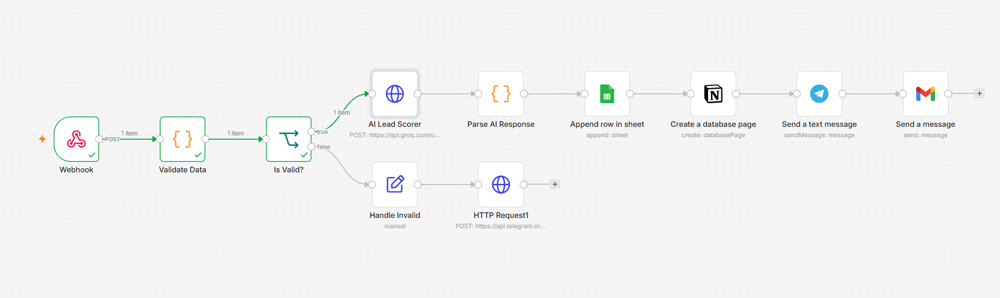
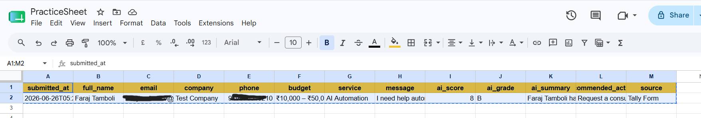
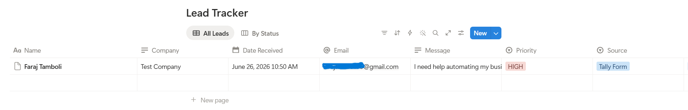
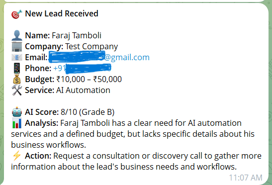
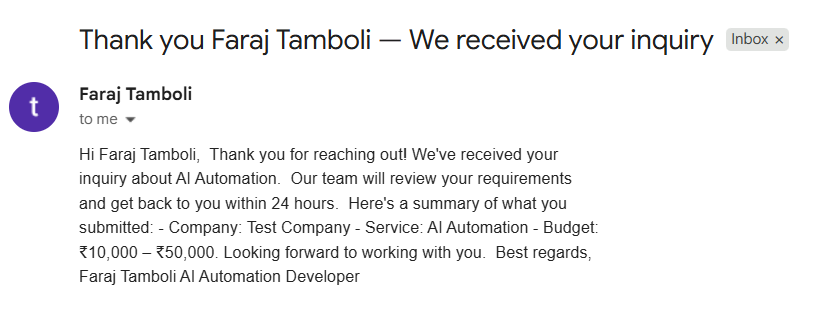

🎯 AI-Powered Lead Capture & Qualification System

A fully automated lead management system that captures form submissions, scores leads using AI, and instantly updates Google Sheets, Notion CRM, Telegram, and Gmail — without any human intervention.

---

🎯 The Problem

Most small businesses lose leads because of slow response times and manual processes. A potential client fills a contact form, and it either gets lost in email, forgotten in a spreadsheet, or seen hours later. By then, the lead has moved on.

Manual lead management means:

Leads fall through the cracks
No instant response to inquiries
Hours wasted copying data between tools
No lead scoring or prioritization
CRM always out of date

---

## ✅ The Solution

The moment someone submits your inquiry form, this system:

1. Captures the submission via webhook instantly
2. Validates all required fields
3. Scores the lead using Groq AI (1–10 with grade and analysis)
4. Logs everything to Google Sheets
5. Creates a CRM page in Notion automatically
6. Sends you an instant Telegram alert with AI analysis
7. Emails the lead a professional welcome message

All of this happens in under 10 seconds. Zero manual effort.

---

## 💼 Business Value

| Metric | Impact |
|---|---|
| Lead response time | Under 10 seconds |
| Manual data entry | Zero |
| Leads lost | Zero |
| Systems updated | 4 simultaneously |
| AI qualification | Every lead scored automatically |
| Setup time for client | Under 1 hour |

### Who needs this:
- Freelancers and consultants managing client inquiries
- Digital agencies handling multiple client leads
- SaaS companies qualifying inbound signups
- Coaches and course creators managing student inquiries
- Any business using a contact or inquiry form

---

## 🤖 AI Lead Scoring

Every lead is automatically analyzed by Groq AI (LLaMA 3) and scored on:
- Budget alignment
- Service fit
- Message clarity and intent
- Company context

Output includes:
- **Score** (1–10)
- **Grade** (A, B, C, D)
- **Summary** (one sentence analysis)
- **Recommended Action** (next step to take)
- Tally Form (lead submits inquiry)

↓

Webhook Trigger (n8n receives data instantly)

↓

Validate Data (Code node — check required fields)

↓

IF node (valid submission?)

│

├── TRUE

│     ↓

│   Groq AI (score and qualify lead)

│     ↓

│   Parse AI Response (Code node)

│     ↓

│   Google Sheets (log all data)

│     ↓

│   Notion CRM (create database page)

│     ↓
│   Telegram (instant alert with AI analysis)

│     ↓

│   Gmail (welcome email to lead)

│

└── FALSE

↓

Handle Invalid → Telegram alert (missing fields warning)
---

## 🗂 Data Captured

| Field | Source | Example |
|---|---|---|
| full_name | Form | Faraj Tamboli |
| email | Form | faraj@gmail.com |
| company | Form | Test Company |
| phone | Form | +919876543210 |
| budget | Form | ₹10,000 – ₹50,000 |
| service | Form | AI Automation |
| message | Form | I need help automating... |
| ai_score | Groq AI | 8 |
| ai_grade | Groq AI | B |
| ai_summary | Groq AI | Clear need, defined budget... |
| recommended_action | Groq AI | Schedule discovery call |
| source | System | Tally Form |
| submitted_at | System | 2026-06-26T05:20:33Z |

---

## 🛠 Tech Stack

| Tool | Purpose |
|---|---|
| n8n | Automation engine |
| Tally.so | Lead capture form |
| Groq API (LLaMA 3) | AI lead scoring |
| Google Sheets | Data logging |
| Notion | CRM database |
| Telegram Bot API | Real-time alerts |
| Gmail | Automated welcome email |
| ngrok | Webhook tunnel (development) |

---

## ⚙️ Setup Guide

### Prerequisites
- n8n installed (Docker or cloud)
- Tally.so account (free)
- Groq API key (free at console.groq.com)
- Google account (Sheets + Gmail)
- Notion account
- Telegram bot (via @BotFather)

### Step 1 — Set up credentials in n8n
1. **Google Sheets OAuth2** → Settings → Credentials → Add
2. **Gmail OAuth2** → same Google account
3. **Notion API** → paste your integration token
4. **Groq** → add as HTTP Request header (Bearer token)
5. **Telegram** → get bot token from @BotFather

### Step 2 — Create Tally form
Build your inquiry form with these fields:
Full Name, Email, Company Name, Phone Number,

Budget (multiple choice), Service Needed (multiple choice), Message
### Step 3 — Set up Google Sheet
Create sheet with these column headers:
submitted_at | full_name | email | company | phone |

budget | service | message | ai_score | ai_grade |

ai_summary | recommended_action | source
### Step 4 — Set up Notion database
Create database with properties:
Name (Title), Email, Company, Message,

Priority (Select), Status (Select), Source (Select), Date Received (Date)

Connect your n8n integration under database Connections.

### Step 5 — Import workflow
1. Download `workflow.json`
2. In n8n → New Workflow → Import from file
3. Update these in the imported workflow:
   - Groq API key in HTTP Request headers
   - Google Sheet ID in Sheets node
   - Notion database ID in Notion node
   - Telegram bot token and chat ID
   - Gmail credential

### Step 6 — Connect Tally webhook
1. In n8n, copy your webhook URL
2. Use ngrok to make it public: `ngrok http 5678`
3. In Tally → Integrations → Webhooks → paste ngrok URL
4. Test by submitting the form

### Step 7 — Activate
Toggle workflow to Active. Every new form submission now triggers the full automation.

---

## 📸 Screenshots

### Workflow Canvas

### Google Sheets Log

### Notion CRM

### Telegram Alert

### Welcome Email

---

## 🔧 Customization Ideas
- Add Slack notifications alongside Telegram
- Connect to HubSpot or Pipedrive instead of Notion
- Add SMS alerts via Twilio for very high scoring leads
- Build a dashboard in Google Sheets with charts
- Add a follow-up email sequence for grade A leads

---

## 👨‍💻 Author

**Faraj Tamboli**
Building production-grade automation systems using n8n, AI APIs, and cloud infrastructure.
---
